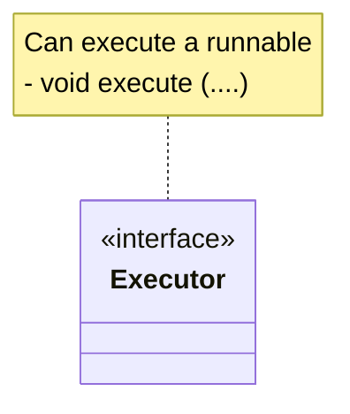
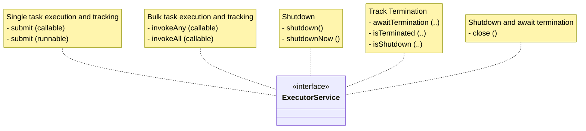
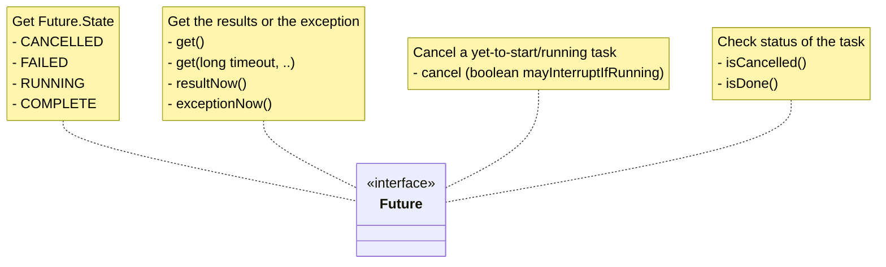

# Interfaces in java.util.concurrent package

### Executor

```mermaid
classDiagram
    class Executor
    <<interface>> Executor
    note for Executor "Can execute a runnable
                         - void execute (....)"
```

### ExecutorService

```mermaid
classDiagram
    class ExecutorService
    <<interface>> ExecutorService
    note for ExecutorService "Single task execution and tracking
                               -  submit (callable)
                               -  submit (runnable)"
    note for ExecutorService "Bulk task execution and tracking
                               -  invokeAny (callable)
                               -  invokeAll (callable)"
    note for ExecutorService "Shutdown
                               -  shutdown()
                               -  shutdownNow ()"
    note for ExecutorService "Track Termination
                               -  awaitTermination (..)
                               -  isTerminated (..)
                               -  isShutdown (..)"
    note for ExecutorService "Shutdown and await termination
                               -  close ()"                       
```

### Future

```mermaid
classDiagram
    class Future
    <<interface>> Future
    note for Future "Get Future.State
                        - CANCELLED
                        - FAILED
                        - RUNNING
                        - COMPLETE"
    note for Future "Get the results or the exception
                      - get()
                      - get(long timeout, ..)
                      - resultNow()
                      - exceptionNow()"
    note for Future "Cancel a yet-to-start/running task
                      - cancel (boolean mayInterruptIfRunning)" 
    note for Future "Check status of the task
                      - isCancelled()
                      - isDone()"
```